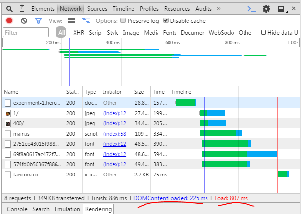

# isomorphic-flux
It's a proof of how implement an isomorphic application.
You can view the result in [heroku](http://experiment-1.herokuapp.com)
## Uses
- Fluxible as Flux implementation.
- Mongolabs.
- SASS.
- Express.js.
- Webpack for bundleling

## Results

## Behaviour
1.- This app do a request to load the initial content in the server.
2.- Dehydrate the stores.
3.- Send to the client.
4.- Loads the app (aka main.js)
5.- Rehydrate the app in the client side.

